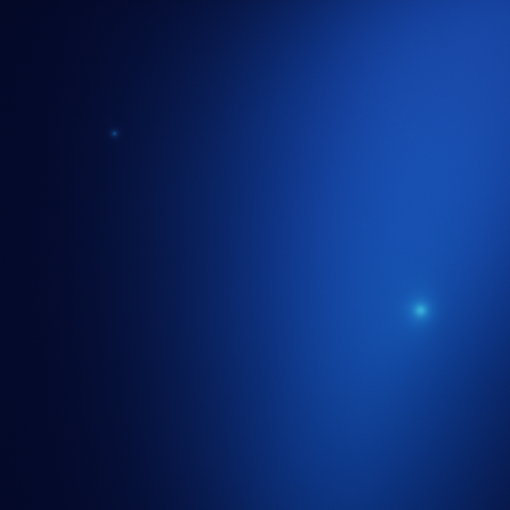

# 🌌 LaraMaster — High-Performance Laravel Web Solutions

Welcome to **LaraMaster**, a sleek, responsive, and modern Laravel agency landing page built with **HTML** and **Tailwind CSS**. Designed for speed, scalability, and stunning visuals — inspired by leading dev studios like Protone Media.

---

## 🚀 Features

- ⚡️ **Hero Section**
  - Eye-catching headline: _“Scalable Web Solutions That Drive Real Results”_
  - Subheadline: _“Crafted with Laravel, Styled with Precision”_
  - Smooth CTA Button: _“Get a Quote”_
  - Beautifully styled with responsive layout and custom fade-in animation.
  - Tech icon stack (Laravel, TailwindCSS, Vue.js)

- 🌌 **Dark Theme**
  - Custom background image for immersive atmosphere.
  - Overlay and blur effects for readability and depth.

- 🧭 **Navigation**
  - Desktop and mobile-friendly top navigation bar.
  - Sticky mobile navbar with icons powered by Remix Icons.

- 💅 **TailwindCSS Setup**
  - CDN-based Tailwind for zero-config styling.
  - Custom animation keyframes.
  - Extended primary color palette for branding.

---

## 📂 Folder Structure

├── assets/
│ ├── dark-texture.png # Background image
│ ├── laramaster-dark-transparent.png # Logo
│ ├── laravel-icon.svg
│ ├── tailwind-icon.svg
│ └── vue-icon.svg
├── index.html # Main HTML file
└── README.md # You are here

---

## 🛠 Technologies Used

- HTML5
- Tailwind CSS (via CDN)
- Remix Icons

---

## 📱 Responsiveness

Designed mobile-first and fully responsive across:

- ✅ Mobile
- ✅ Tablet
- ✅ Desktop

---

## ✅ Next Steps

- [ ] Add About & Services section
- [ ] Add client testimonials or project highlights
- [ ] Add form to `#contact` section
- [ ] Hook up with Laravel backend or form handler

---

## 📸 Preview

 <!-- Replace with actual screenshot path later -->

---

## 📬 Contact

Built with ♥ by Ruchi Badkur .  
Feel free to contribute, fork, or get in touch for enhancements!

